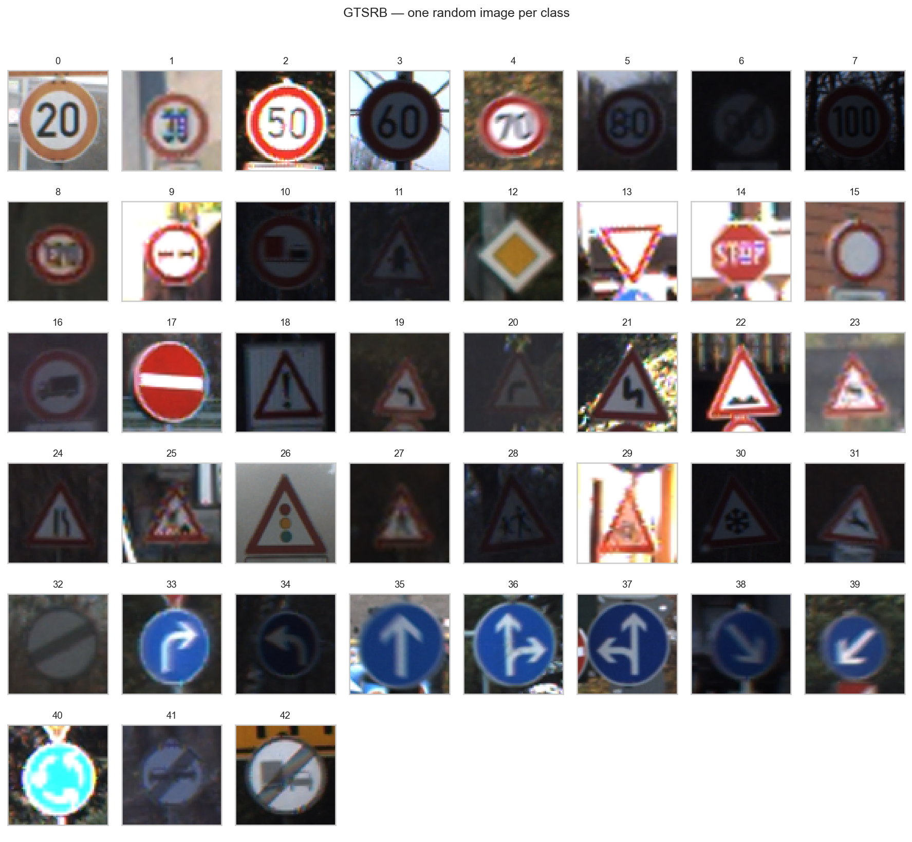
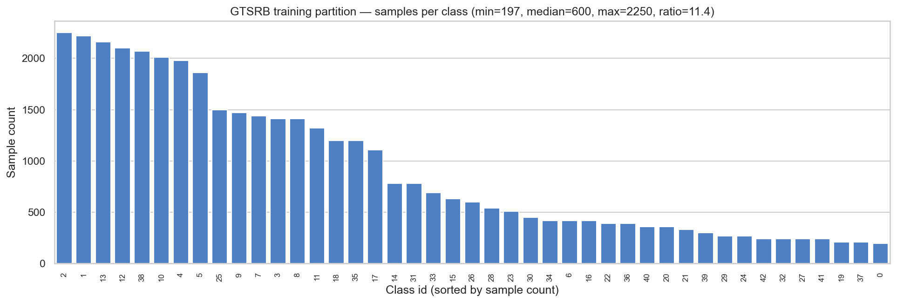
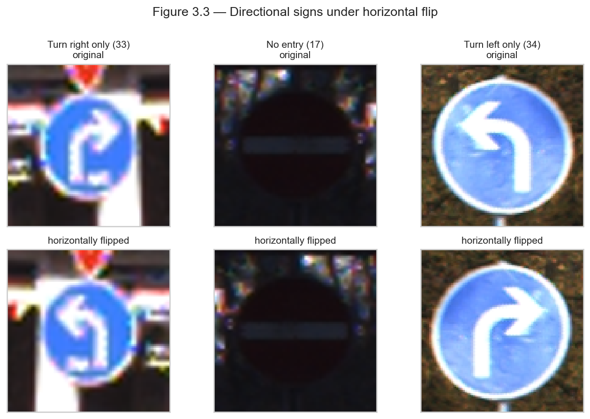

# 3. Dataset

The empirical claims of this report are made against the German
Traffic Sign Recognition Benchmark (GTSRB). The preceding chapters
have referenced this benchmark without detailed description; the
purpose of the present chapter is to characterise it fully, with the
specific level of detail required for informed interpretation of
the experimental results that follow. The characterisation is
organised into six sections: provenance and licensing, dataset
structure, capture conditions, the official partition, the
stratified validation carve-out adopted in this work, and the
task-specific challenges that shape both the augmentation pipeline
and the expected failure modes.

## 3.1 Provenance and licensing

The dataset was compiled by the Institut für Neuroinformatik of the
Ruhr-Universität Bochum and first released in connection with a
competition at the 2011 International Joint Conference on Neural
Networks. The canonical reference is [Stallkamp et al.
(2012)](references.md#stallkamp2012man); a related dataset addressing
the detection rather than the classification task, but based on the
same raw video footage, is described by [Houben et al.
(2013)](references.md#houben2013detection).

The dataset is redistributed by its originating institution under
terms that permit use for research and teaching, including
redistribution of derived results, subject to proper attribution.
The present report does not include the raw images in the public
code repository; readers wishing to reproduce the experiments are
directed to the official distribution, whose download and directory
conventions are documented in `data/README.md`. This separation
between code and data reflects two considerations: the licence of
the dataset is distinct from that of the code, which is released
under the MIT licence; and the aggregate size of the image corpus,
approximately 350 megabytes after extraction, exceeds the size
thresholds that make inclusion in a version-controlled repository
operationally practical.

## 3.2 Structure

The benchmark comprises two disjoint partitions. The training
partition contains 39 209 colour images distributed across 43
classes; the test partition contains 12 630 colour images drawn
from the same 43 classes but captured in temporally and
geographically distinct driving sessions. Each class is identified
by a five-digit zero-padded integer index, from `00000` to `00042`,
and corresponds to a specific German traffic sign whose visual
identity is prescribed by the *Straßenverkehrs-Ordnung* and
associated technical standards. The class index is an arbitrary
enumeration rather than a semantic ordering.

The 43 classes span several traffic-regulatory functions, including
prohibitory signs (speed limits, no-entry, no-overtaking), warning
signs (curve, pedestrian, school), mandatory signs (turn directions,
roundabout entry), and priority signs (stop, yield, priority road).
A sample grid showing one representative image drawn at random from
each class is provided in Figure 3.1.

**Figure 3.1.** Random sample, one image per class, drawn from the
training partition of the GTSRB benchmark. Images have been resized
to a common 64 × 64 pixel grid for display; the original images
vary in resolution (see § 3.3). Class indices are displayed above
each tile.

The per-class sample counts in the training partition exhibit
pronounced imbalance. Table 3.1 summarises the relevant
descriptive statistics; the full per-class histogram is shown in
Figure 3.2.

**Table 3.1.** Per-class sample count statistics, training
partition.

| Statistic | Value |
|---|---:|
| Number of classes | 43 |
| Total images | 39 209 |
| Minimum images per class | 210 |
| Maximum images per class | 2 250 |
| Mean images per class | 912 |
| Median images per class | 540 |
| Imbalance ratio (max / min) | 10.7 |

**Figure 3.2.** Distribution of sample counts per class in the
training partition, sorted from most to least populated. The
imbalance is pronounced but not pathological: no class is below the
threshold at which overfitting to a handful of examples would
dominate the training dynamics, and no class dominates to the point
of rendering the aggregate accuracy insensitive to performance on
the remaining classes.

The implication of the imbalance pattern for the experimental
protocol is that evaluation metrics sensitive to class weighting,
notably the Matthews correlation coefficient of [Chicco and Jurman
(2020)](references.md#chicco2020advantages) and Cohen's κ, are
reported alongside aggregate accuracy in § 7. Aggregate accuracy
alone is insufficient because a classifier that systematically
fails on the least populated classes can nonetheless achieve high
aggregate accuracy by performing well on the most populated ones.
For the degree of imbalance exhibited by GTSRB, this caveat is
material rather than theoretical: the eight least populated classes
together contribute approximately 4 % of the training data, such
that a classifier with zero accuracy on those classes could still
report an aggregate accuracy above 95 %.

## 3.3 Capture conditions

The images were extracted from video footage captured during real
driving sessions on German roads. This provenance has several
consequences that distinguish GTSRB from benchmarks composed of
pre-selected, canonically oriented reference images.

**Resolution heterogeneity.** The physical distance between camera
and sign varies across frames, producing a corresponding variation
in the pixel resolution at which each sign is captured. The
resolution of individual images spans approximately 15 × 15 pixels
at the low end to approximately 250 × 250 pixels at the high end.
The median image is approximately 40 × 40 pixels. Because the
classifier architectures considered in this work expect a fixed
input resolution, all images are resampled to 48 × 48 pixels during
pre-processing; the implications of this choice, including the
information loss for the smallest images and the interpolation
artefacts for the largest, are discussed in § 6.

**Illumination variation.** Captures occur across a range of daytime
and weather conditions. Direct sunlight, overcast sky, late-
afternoon low-angle lighting, and partial shading from overhead
structures are all represented. The resulting brightness
distribution of the corpus is sufficiently broad that training-time
brightness jitter is both feasible and useful for generalisation;
the specific augmentation parameters are documented in § 6.

**Motion and pose.** Because the capture platform is in motion, the
signs in many images exhibit non-zero apparent rotation relative to
the image axes, arising from camera tilt, roll of the ego vehicle,
or non-planar mounting of the physical sign. A smaller subset
exhibits motion blur. The combined effect is that geometric
canonicalisation — of the kind a spatial transformer network is
designed to learn — is a plausible inductive bias for this dataset,
though whether it translates into improved test accuracy is, as
argued in § 2.3, an empirical question rather than a deductive one.

**Occlusion.** A small but non-negligible fraction of images
exhibits partial occlusion, typically from foreground vehicles, tree
branches, or signpost hardware. These cases are not separately
annotated; occluded images are simply present in both training and
test partitions with their canonical class label.

The aggregate effect of these capture conditions is that the GTSRB
input distribution approximates, within the closed 43-class label
set, the open-world distribution that a deployed classifier would
encounter. This approximation is imperfect — footage from a single
country, a single period, and a single capture apparatus cannot
span the operational distribution of a global classifier — but it
is substantially more representative than a benchmark composed of
pre-selected reference images, and it is sufficient to motivate
architectural and training-protocol choices whose justifications
depend on the presence of geometric and photometric variability.

## 3.4 The official partition

The dataset is distributed with a predefined split into training and
test partitions. The training partition of 39 209 images is
organised into 43 sub-directories, one per class, each containing
the images labelled as that class. The test partition of 12 630
images is distributed in a single flat directory, with a
separately-provided comma-separated annotation file mapping each
image filename to its class label. A small utility script,
`scripts/prepare_test_set.py`, is supplied in the accompanying
repository to convert the flat test directory into the same
class-sub-directory layout as the training partition, so that both
partitions can be consumed by the standard
`torchvision.datasets.ImageFolder` interface without special-case
logic.

The partitioning into training and test sets was performed at the
level of source video sequences by the dataset originators, rather
than by random assignment of individual images. That is, all frames
deriving from a given continuous capture sequence are assigned to
the same partition. This design choice has a specific
methodological purpose: were images partitioned at random, the
near-duplicate frames within a single sequence would be split
across partitions, and the test set would contain images whose
near-neighbours in the training set were nearly identical. The
sequence-level partitioning prevents this leakage and ensures that
test performance reflects generalisation to novel capture
conditions rather than to novel transformations of seen data.

For the purposes of this report, the official partition is treated
as authoritative. No re-partitioning of the training or test sets
is performed; the test set in particular is touched only by the
evaluation code and never by any component of the training
pipeline. The rationale for this strict separation is elaborated
in § 3.5 and § 4.2.

## 3.5 Stratified validation carve-out

The official partition provides a training set and a test set, but
no held-out validation set for hyperparameter selection and model
comparison. A validation set is nonetheless required, because the
protocol adopted in this work holds the test set inviolable and
forbids its use during training or model selection. The
alternative, adopted here, is to carve a validation set out of the
official training partition.

The carve-out is performed stratified by class: within each class,
20 % of the images are assigned to a validation fold and the
remaining 80 % are retained for training. Stratification preserves
the per-class count ratios of the original training partition in
both sub-folds, which matters because random unstratified
sub-sampling of a class-imbalanced dataset can, with non-trivial
probability, produce sub-folds whose per-class composition differs
from the source distribution by amounts that confound the
interpretation of per-class metrics. The stratified variant
eliminates this source of variance.

The stratified assignment is parameterised by the seed defined in
the experimental configuration (`seed: 42` in the shipped configs),
such that identical sub-folds are constructed on every run of the
training pipeline. The assignment algorithm is documented in
`src/traffic_signs/data/gtsrb.py` and amounts to, per class,
sorting the class members by filename, permuting the sorted list
with a seeded pseudo-random generator, and assigning the first 20 %
of the permuted list to the validation fold. The specific choice
of permutation algorithm is not methodologically consequential; what
matters is that the assignment is deterministic and stratified.

Two properties of the carve-out are worth emphasising. First, it is
performed at the level of image files rather than at the level of
source video sequences. The dataset as released does not expose
the source-sequence identifiers of individual training images, and
so sequence-level stratification is not feasible at the image-folder
interface. The consequence is that the validation fold may contain
near-duplicates of training images drawn from the same source
sequence, which makes validation accuracy a mildly optimistic
estimate of what accuracy on a genuinely novel sequence would be.
This is a known limitation and is one of the reasons the test set —
which is sequence-separated by construction — remains the
authoritative measure.

Second, the validation fold is used for three purposes and three
only: for monitoring training dynamics epoch by epoch; for
triggering early stopping when validation loss ceases to improve;
and for selection of the checkpoint — the best-on-validation rather
than the final — that is evaluated on the test set. It is not used
to choose between architectures, to tune hyperparameters, or to
guide any decision that would make it part of the effective
training signal. This restriction is enforced by protocol rather
than by code, and is an aspect of the experimental design that
chapter 8 revisits in the context of the validation–test divergence
that is observed across the three architectures.

## 3.6 Task-specific challenges

Two further properties of the benchmark warrant specific attention
before the experimental chapters begin, both because they are
methodologically consequential and because they have influenced
design choices visible in the training pipeline.

**Directional signs and the horizontal flip.** Several of the 43
classes depict signs whose semantic meaning is orientation-dependent.
These include, but are not limited to: the "no entry" sign (class
17), which displays a horizontal bar that would remain visually
indistinguishable under flipping but whose prohibitive meaning is
oriented; the four mandatory direction signs (classes 33, 34, 35,
36), which depict arrows pointing right, left, straight, or
combinations thereof; the "beware of animals" and "right curve"
warning signs, whose depicted geometry is mirror-asymmetric; and
the priority-road sign (class 12), whose internal shading gradient
is orientation-specific. For these classes, a horizontal flip
transformation applied during data augmentation produces an image
that, if interpreted according to the semantics of the original
label, would be misclassified as a *different* class — namely the
class whose canonical image is the mirror image of the original.

Figure 3.3 illustrates three representative examples.

**Figure 3.3.** Three directional signs from GTSRB (classes 33,
17, and 34) in their canonical orientation and under horizontal
flip. The flipped variant of the turn-right sign becomes visually
identical to the turn-left sign; the flipped variant of the no-entry
sign is unchanged in appearance but semantically inverted; the
flipped variant of the turn-left sign becomes visually identical
to the turn-right sign. A training pipeline that applies
horizontal flipping as an augmentation operation, without class-aware
masking, therefore trains the classifier against label noise of
magnitude proportional to the frequency of the affected classes.

The practical implication is that horizontal flipping must be
disabled for GTSRB, or, alternatively, must be gated on a
per-class basis so that only classes for which a flip produces a
semantically equivalent image are so augmented. The training
pipeline of the present work adopts the simpler of these options:
horizontal flipping is disabled uniformly. The rationale for this
choice, and the bug in the pre-refactoring code base that it
corrects, is discussed further in § 9.

**Inter-class visual similarity.** A distinct but related
challenge arises from pairs of classes whose visual appearance
differs only in small details. The most commonly confused pairs
involve the numeric speed-limit signs: classes corresponding to the
30 km/h, 50 km/h, and 80 km/h limits differ only in the glyphs of
the displayed numerals, and at the low-resolution end of the image
distribution (§ 3.3) those glyphs occupy a small number of pixels.
The consequence is a structural lower bound on the achievable
per-class precision for these classes. The confusion matrices
reported in § 7.3 exhibit this lower bound as a recurring diagonal
band of off-diagonal confusion among numeric speed-limit classes
in all three architectures. No augmentation or architectural
choice considered in this report removes this bound; its presence
is a property of the dataset rather than of the classifiers.

## 3.7 Summary

The GTSRB benchmark is a 43-class colour image classification
dataset comprising 39 209 training and 12 630 test images, drawn
from real driving video, pre-partitioned at the level of source
sequences, and exhibiting moderate but non-negligible class
imbalance. The experimental protocol of this report preserves the
official partition, carves a stratified validation fold out of the
training partition for checkpoint selection, and defers all
test-set exposure to final evaluation. Two task-specific properties
— the presence of directional signs and the inter-class visual
similarity among numeric speed-limit classes — enter the subsequent
chapters as specific design constraints. The augmentation pipeline
of § 6 reflects the first; the error analysis of § 7.4 reflects
the second.
