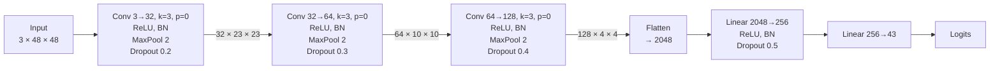

# 5. Architectures

This chapter specifies the three architectures whose comparison
constitutes the empirical content of this report. The specification
is intended to be sufficient for independent reproduction: tensor
shapes at every stage, parameter count derivations block by block,
and the mathematical definition of the non-standard components are
all provided. Training-time concerns — optimiser, learning-rate
schedule, augmentation — are deferred to chapter 6; the present
treatment is architectural.

The three architectures have been chosen so that a single structural
variable is changed between any two of them. `TrafficSignNet` (§ 5.1)
is a three-block convolutional baseline. `TrafficSignNet-STN` (§ 5.2)
prepends a spatial transformer front-end to the same classifier
backbone, isolating the effect of explicit geometric canonicalisation.
`DeepTrafficNet` (§ 5.3) replaces the three-block feature extractor
with a five-block variant of larger channel width, isolating the
effect of additional depth and capacity. A comparative summary of
parameter and floating-point operation (FLOP) counts follows in
§ 5.4.

## 5.1 TrafficSignNet

`TrafficSignNet` is a straightforward instance of the convolutional
classification idiom established by
[LeCun et al. (1998)](references.md#lecun1998gradient) and
generalised to colour natural imagery by
[Krizhevsky et al. (2012)](references.md#krizhevsky2012imagenet).
It consists of three convolutional blocks followed by a
two-layer dense classifier. Each convolutional block contains, in
order, a 3 × 3 convolution without padding, a ReLU non-linearity, a
2D batch normalisation layer following
[Ioffe and Szegedy (2015)](references.md#ioffe2015batch), a 2 × 2
max-pool, and a dropout layer. The dense classifier consists of a
linear projection to 256 units, a ReLU, a 1D batch normalisation
layer, a dropout, and a final linear projection to the 43 output
classes.

**Figure 5.1.** Block-level architecture of `TrafficSignNet`. Each
convolutional block halves the spatial resolution (via max-pooling)
and roughly doubles the channel count; the dropout rate increases
with depth, following the convention that deeper features have
greater representational specialisation and hence greater
overfitting susceptibility.

Two design decisions in this architecture warrant comment. The first
is the choice of padding. The 3 × 3 convolutions are applied without
padding (`padding = 0` in PyTorch), such that each convolution shrinks
the spatial resolution by two pixels along each axis before the
subsequent max-pool halves it further. The alternative, zero-padding
to preserve spatial resolution, is adopted by the other two
architectures and is strictly preferable for very deep stacks, where
unpadded convolutions exhaust the available resolution before
semantically useful features are extracted. For the present
three-block baseline, the unpadded variant reduces the flattened
feature dimension at the classifier input from $128 \times 6 \times
6 = 4608$ to $128 \times 4 \times 4 = 2048$, which in turn reduces
the parameter count of the first linear layer from approximately
1.2 M to approximately 0.52 M. The reduction is substantive; the
information loss from the narrower receptive-field coverage at the
borders is small for the relatively centred sign imagery of GTSRB.

The second is the dropout ladder. The dropout rates applied after
the three max-pool operations are 0.2, 0.3, and 0.4, with a further
rate of 0.5 applied after the first dense layer. This monotone
progression reflects the standard heuristic, documented by
[Srivastava et al. (2014)](references.md#srivastava2014dropout), that
deeper features benefit from higher regularisation because they
encode task-specific information that risks overfitting to the
training distribution, whereas shallower features encode general
visual primitives for which overfitting is less consequential.

The parameter count of `TrafficSignNet` is derived as follows.
Convolutional layer $\ell$ with $C_{\mathrm{in},\ell}$ input channels,
$C_{\mathrm{out},\ell}$ output channels, and a $k_\ell \times k_\ell$
kernel contributes
$P_\ell^{\mathrm{conv}} = C_{\mathrm{in},\ell} \cdot C_{\mathrm{out},\ell} \cdot k_\ell^2 + C_{\mathrm{out},\ell}$
parameters (weights and biases). A 2D batch normalisation layer on
$C$ channels contributes $2C$ parameters. A linear layer from
$d_{\mathrm{in}}$ to $d_{\mathrm{out}}$ dimensions contributes
$d_{\mathrm{in}} \cdot d_{\mathrm{out}} + d_{\mathrm{out}}$. Summing
across the layers of `TrafficSignNet` gives

$$
P^{\mathrm{conv}} = 896 + 18{,}496 + 73{,}856 = 93{,}248, \qquad P^{\mathrm{bn}} = 64 + 128 + 256 + 512 = 960, \tag{5.1}
$$

$$
P^{\mathrm{dense}} = (2048 \cdot 256 + 256) + (256 \cdot 43 + 43) = 524{,}544 + 11{,}051 = 535{,}595, \tag{5.2}
$$

summing to a total of **629 803** parameters. Equivalently, the
model has approximately 0.63 M parameters, a parameter budget that
places it at the low end of contemporary convolutional classifiers
for colour imagery and that makes it trainable on modest hardware.

## 5.2 TrafficSignNet-STN

`TrafficSignNet-STN` extends the baseline by prepending a spatial
transformer network, following
[Jaderberg et al. (2015)](references.md#jaderberg2015spatial), and by
using padded 3 × 3 convolutions in the classifier backbone. The
spatial transformer consists of a **localisation subnetwork** that
predicts six affine transformation parameters from the input image, a
**grid generator** that converts those parameters into a sampling
grid over the output tensor, and a **differentiable bilinear sampler**
that applies the transformation. The backbone classifier is a
three-block convolutional network analogous to `TrafficSignNet`, with
the differences enumerated below.

**Figure 5.2.** Block-level architecture of `TrafficSignNet-STN`.
The spatial transformer (shaded) operates on the raw input; its
output is fed into a convolutional backbone that is architecturally
similar to the baseline but uses padded convolutions throughout.

```mermaid
flowchart LR
    I[Input<br/>3 × 48 × 48] --> STN{Spatial<br/>Transformer}
    STN --> B1[Conv 3→32, k=3, p=1<br/>BN, ReLU<br/>MaxPool 2]
    B1 -->|32 × 24 × 24| B2[Conv 32→64, k=3, p=1<br/>BN, ReLU<br/>MaxPool 2]
    B2 -->|64 × 12 × 12| B3[Conv 64→128, k=3, p=1<br/>BN, ReLU<br/>MaxPool 2]
    B3 -->|128 × 6 × 6| F[Flatten<br/>→ 4608]
    F --> L1[Linear 4608→256<br/>ReLU, Dropout 0.5]
    L1 --> L2[Linear 256→43]
    L2 --> O[Logits]

    subgraph STN[Spatial Transformer]
        direction LR
        Loc[Conv 3→8 k=7<br/>ReLU, MaxPool 2<br/>Conv 8→10 k=5<br/>ReLU, MaxPool 2] --> FL[Linear 640→32<br/>ReLU<br/>Linear 32→6]
        FL --> Grid[affine_grid]
        Grid --> Samp[grid_sample<br/>bilinear]
    end
```

### 5.2.1 The spatial-transformer operation

Formally, let $\mathbf{x} \in \mathbb{R}^{3 \times H \times W}$
denote the input image. The localisation subnetwork $g_\phi$
produces a vector of six real numbers from $\mathbf{x}$:

$$
g_\phi(\mathbf{x}) = (\theta_{11}, \theta_{12}, \theta_{13}, \theta_{21}, \theta_{22}, \theta_{23}) \in \mathbb{R}^{6}. \tag{5.3}
$$

These six numbers are arranged into a $2 \times 3$ affine matrix
$\boldsymbol{\Theta}$ whose first row is
$(\theta_{11}, \theta_{12}, \theta_{13})$ and whose second row is
$(\theta_{21}, \theta_{22}, \theta_{23})$:

$$
\boldsymbol{\Theta} = \mathrm{reshape}\bigl((\theta_{11}, \theta_{12}, \theta_{13}, \theta_{21}, \theta_{22}, \theta_{23}), (2, 3)\bigr). \tag{5.4}
$$

The first two columns of $\boldsymbol{\Theta}$ encode rotation,
scaling, and shear, and its third column encodes translation. For
each spatial location $(i, j)$ in the output tensor, the grid
generator computes a corresponding sampling location
$(u_{ij}, v_{ij})$ in the input by the affine map

$$
u_{ij} = \theta_{11} x_{ij} + \theta_{12} y_{ij} + \theta_{13}, \qquad v_{ij} = \theta_{21} x_{ij} + \theta_{22} y_{ij} + \theta_{23}, \tag{5.5}
$$

where $(x_{ij}, y_{ij})$ is the normalised coordinate of output
location $(i, j)$ in the range $[-1, +1]$. The sampler then
evaluates the input at the continuous location $(u_{ij}, v_{ij})$
by bilinear interpolation of the four nearest pixel values. Because
bilinear interpolation is differentiable in both the sampled values
and the sampling location, gradients flow back through the sampler
into the localisation subnetwork, such that the entire module is
trainable end-to-end without explicit supervision of the
transformation.

Two practical consequences of this design bear on the present work.
First, the localisation subnetwork must be initialised with care:
random initialisation typically produces transformations that
severely distort the input, from which the subsequent classifier
cannot recover. Following the recommendation of [Jaderberg et al.
(2015)](references.md#jaderberg2015spatial), the final linear layer
of the localisation head is initialised to the identity
transformation, with weights zeroed and bias set to

$$
\mathbf{b} = (1,\ 0,\ 0,\ 0,\ 1,\ 0)^{\top}. \tag{5.6}
$$

With this initialisation, $\boldsymbol{\Theta}$ at training
initialisation is the identity affine matrix, the sampling grid
produces the input unchanged, and the spatial transformer is a
no-op that acquires non-trivial transformations only to the extent
that they reduce the downstream classification loss.

Second, the subsequent classifier operates on the *transformed*
input rather than the original one. The spatial resolution at the
classifier input is accordingly the output resolution of the
sampler, which in the present configuration is chosen to match the
input resolution at 48 × 48. No information is gained by the
spatial transformer per se; what the module contributes is a
data-dependent reparameterisation of the input distribution that,
if learned well, simplifies the classification problem.

### 5.2.2 Backbone differences

The convolutional backbone of `TrafficSignNet-STN` differs from the
baseline in two respects. First, the 3 × 3 convolutions are applied
with $p = 1$ padding, preserving spatial resolution until the
subsequent max-pool halves it. The consequence is that the
flattened feature dimension at the classifier input is
$128 \times 6 \times 6 = 4608$ rather than the baseline's 2048. The
larger input dimension inflates the first dense layer's parameter
count from 524 544 in `TrafficSignNet` to 1 179 904 in
`TrafficSignNet-STN`. Second, the baseline's per-block dropout
ladder is omitted in the STN variant, and the 1D batch normalisation
after the first dense layer is dropped. These simplifications reflect
the configuration released with the baseline v0.2.0 code.

The total parameter count of `TrafficSignNet-STN` aggregates as
follows:

$$
P^{\mathrm{STN}} = 3194 + 20710 + 93696 + 1190955 = 1308555 \tag{5.7}
$$

where the four terms correspond respectively to the localisation
subnetwork's convolutional layers (3 194), the localisation
subnetwork's dense layers (20 710), the padded backbone
convolutions (93 696), and the dense classifier head (1 190 955).

Equivalently, the model has approximately 1.31 M parameters,
approximately 2.1 times the size of the baseline. Of this addition,
approximately 2 % (the localisation subnetwork proper) is devoted
to learning the affine transformation; the remainder arises from the
denser flattened feature representation at the classifier input.

## 5.3 DeepTrafficNet

`DeepTrafficNet` retains the basic convolutional idiom but extends
the feature extractor to five blocks and increases the terminal
channel width from 128 to 512. Each block consists, as in the STN
variant, of a padded 3 × 3 convolution, a 2D batch normalisation,
a ReLU, and a 2 × 2 max-pool. The classifier is a three-layer
multilayer perceptron with a single dropout rate of 0.3 applied
between dense layers.

**Figure 5.3.** Block-level architecture of `DeepTrafficNet`. The
five-block feature extractor reduces the 48 × 48 input to a
1 × 1 × 512 feature vector; the three-layer dense head maps this
vector to the 43 output classes.

```mermaid
flowchart LR
    I[Input<br/>3 × 48 × 48] --> B1[Conv 3→32, k=3, p=1<br/>BN, ReLU<br/>MaxPool 2]
    B1 -->|32 × 24 × 24| B2[Conv 32→64, k=3, p=1<br/>BN, ReLU<br/>MaxPool 2]
    B2 -->|64 × 12 × 12| B3[Conv 64→128, k=3, p=1<br/>BN, ReLU<br/>MaxPool 2]
    B3 -->|128 × 6 × 6| B4[Conv 128→256, k=3, p=1<br/>BN, ReLU<br/>MaxPool 2]
    B4 -->|256 × 3 × 3| B5[Conv 256→512, k=3, p=1<br/>BN, ReLU<br/>MaxPool 2]
    B5 -->|512 × 1 × 1| F[Flatten<br/>→ 512]
    F --> L1[Linear 512→512<br/>ReLU, Dropout 0.3]
    L1 --> L2[Linear 512→256<br/>ReLU, Dropout 0.3]
    L2 --> L3[Linear 256→43]
    L3 --> O[Logits]
```

Three design considerations distinguish this architecture.

**Depth and receptive field.** Each additional block doubles the
effective receptive field at no cost in parameter count for the
spatial dimensions, while doubling the channel count contributes
to representational capacity along the feature axis. The terminal
receptive field of `DeepTrafficNet` covers the entire 48 × 48 input,
which is to say that each unit in the final convolutional feature
map summarises information from the whole image. This contrasts
with the baseline, whose terminal receptive field covers a
substantially smaller sub-region of the input.

**Aggressive spatial reduction.** With five max-pool operations on
a 48 × 48 input, the final feature map is 1 × 1 × 512. This
aggressive reduction has two consequences. First, the flattened
representation at the classifier input is of fixed dimension 512
independently of $H$ and $W$, so long as the input is at least
32 × 32. Second, the classifier is not required to handle a
high-dimensional flattened input, which constrains the parameter
count of the first dense layer. The alternative — a larger
final spatial resolution — would inflate the first dense layer
substantially, as is the case in `TrafficSignNet-STN`.

**Depth versus width.** The doubling channel progression
$32 \to 64 \to 128 \to 256 \to 512$ follows the convention
established in the VGG family of [Simonyan and Zisserman
(2015)](references.md#simonyan2015very) and generalised in subsequent
architectures such as the residual networks of
[He et al. (2016)](references.md#he2016deep). The convention reflects
the empirical observation that the information content of
successively coarser feature maps rises approximately at the rate at
which their spatial extent falls, so that holding the per-unit
information budget approximately constant requires channel doubling.
Whether this depth-and-width scaling is the optimal expansion
strategy for the modest scale of GTSRB is an open question, and one
that is relevant to the empirical results reported in chapter 7.

The parameter count of `DeepTrafficNet` is dominated by the deeper
convolutional layers. The five convolutions alone contribute
approximately 1.57 M parameters; the three dense layers contribute a
further 0.40 M. The total is **1 975 595** parameters, or
approximately 1.98 M. This is approximately 3.1 times the size of
the baseline and approximately 1.5 times the size of the STN
variant.

## 5.4 Comparative summary

Table 5.1 summarises the structural and computational properties of
the three architectures.

**Table 5.1.** Parameter and FLOP counts for the three architectures,
on a 3 × 48 × 48 input. FLOP counts are reported per forward pass
and exclude the cost of batch normalisation, pooling, non-linearities,
and dropout, which contribute negligibly to the total.

| Architecture | Conv params | Dense params | Total params | FLOPs |
|---|---:|---:|---:|---:|
| `TrafficSignNet` | 93.2 k | 535.6 k | **629 803** | 15.2 M |
| `TrafficSignNet-STN` | 96.9 k | 1.21 M | **1 308 555** | 27.1 M |
| `DeepTrafficNet` | 1.57 M | 0.40 M | **1 975 595** | 44.9 M |

The three architectures span approximately a 3 × range in parameter
count and approximately a 3 × range in FLOP count. The ranges are
more modest than the order-of-magnitude spread found in larger
comparative studies on benchmarks of higher label-space cardinality,
but they are sufficient to interrogate whether, at the moderate
scale of GTSRB, parameter budget alone predicts test-set
generalisation.

A secondary observation visible in Table 5.1 is that the three
architectures distribute their parameters between convolutional
and dense components differently. In `TrafficSignNet`, 85 % of
parameters reside in the dense classifier; in
`TrafficSignNet-STN`, 92 % in the dense component (a consequence of
the padded convolutions and the larger flattened feature
dimension); in `DeepTrafficNet`, only 20 % in the dense component
and 80 % in the convolutional feature extractor. The three
architectures therefore differ not only in aggregate size but in
the allocation of that size between feature learning and
classification. Whether this allocation affects generalisation is a
question returned to in chapter 8, where the interpretive
framework of [Belkin et al. (2019)](references.md#belkin2019reconciling)
on the relationship between overparameterisation and generalisation
is applied to the observed results.

## 5.5 Architectural trade-offs and prior expectations

The three architectures described in this chapter each make an
implicit claim about which aspect of the classification problem is
the binding constraint on generalisation performance. Stating these
claims explicitly clarifies what the experimental comparison of
chapter 7 is able to answer.

`TrafficSignNet` claims that **expressive capacity is not the
binding constraint**. On this view, the 48 × 48 colour image of a
regulatorily canonicalised sign contains sufficient low-to-medium
frequency information that a three-block convolutional feature
extractor, coupled to a 256-unit dense classifier, has enough
representational capacity to separate the 43 classes. Any
additional capacity is expected to yield diminishing returns at best
and overfitting at worst.

`TrafficSignNet-STN` claims that **geometric variability is the
binding constraint**. On this view, the intra-class variability in
GTSRB is substantially attributable to affine distortions of the
canonical sign appearance, and a feature extractor that operates on
a geometrically canonicalised input will produce tighter intra-class
clusters than one that does not. The spatial transformer front-end
is the architectural expression of this claim.

`DeepTrafficNet` claims that **feature hierarchy is the binding
constraint**. On this view, the visual similarity among confusable
class pairs — notably the numeric speed-limit signs of § 3.6 —
requires feature extraction at a deeper level than the three-block
baseline can provide, and the additional depth of a five-block
extractor yields sufficient high-level discriminability to resolve
the near-duplicate pairs.

These three claims are not mutually exclusive, but they are
distinguishable in their empirical consequences. If the baseline's
claim is correct, the addition of a spatial transformer or
additional depth should produce marginal or negative effects on
held-out accuracy. If the STN claim is correct, the STN variant
should outperform the baseline by a margin proportional to the
geometric variability in the test distribution. If the depth claim
is correct, the deeper variant should outperform on exactly those
class pairs where the near-duplicate phenomenon dominates.
Chapter 7 reports the observations against which these three
claims are tested; chapter 8 interprets the observations.

The architectures having been specified and their implicit claims
articulated, the training setup through which they are fit to the
data is documented in chapter 6.
