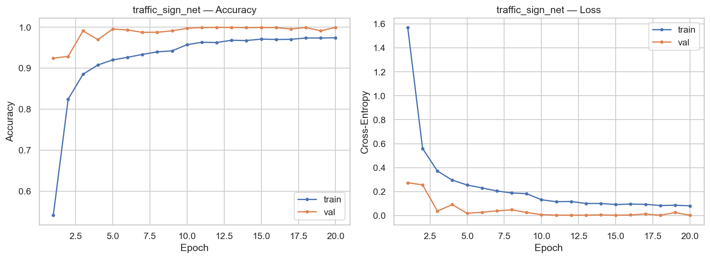
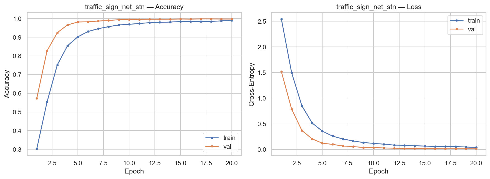
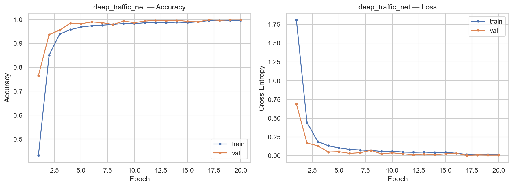
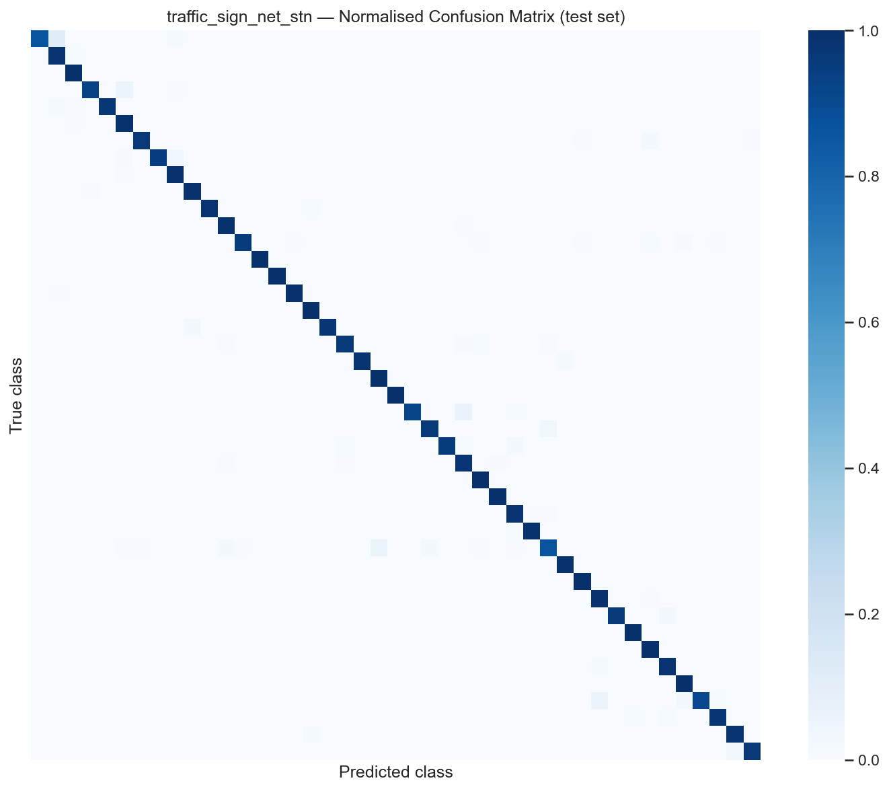
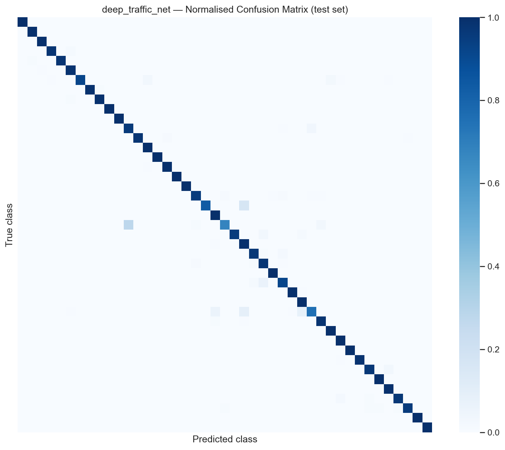

# 7. Results

The three architectures specified in chapter 5, trained under the
protocol documented in chapter 6, are evaluated on the official
GTSRB test set of 12 630 images according to the metrics defined
in § 4.3. The present chapter reports the resulting numbers. In
keeping with the separation of description and interpretation
maintained throughout this document, no claims about the meaning,
cause, or implication of the observations are made here; those
belong to chapter 8.

The chapter is organised into six sections. The first presents the
headline test-set metrics. The second reports the training
trajectories of all three architectures. The third presents the
per-model confusion matrices. The fourth analyses the per-class
precision and recall behaviour. The fifth identifies the classes
on which all three architectures fail concordantly. The sixth
identifies classes on which the three architectures disagree.

## 7.1 Headline test-set metrics

The five metrics introduced in § 4.3 are reported in Table 7.1 for
each of the three architectures. All values derive from a single
evaluation run per model, conducted after training was complete, on
the official GTSRB test set of 12 630 images with the
best-on-validation checkpoint of each training trajectory.

**Table 7.1.** Headline metrics on the official GTSRB test set,
N = 12 630. Best value in each column is bold.

| Metric | `TrafficSignNet` | `TrafficSignNet-STN` | `DeepTrafficNet` |
|---|---:|---:|---:|
| Accuracy | **98.75 %** | 97.94 % | 98.08 % |
| Top-5 accuracy | **99.91 %** | 99.80 % | 99.79 % |
| Cross-entropy loss | **0.0383** | 0.0702 | 0.0712 |
| Matthews correlation coefficient | **0.9870** | 0.9786 | 0.9801 |
| Cohen's κ | **0.9870** | 0.9786 | 0.9801 |

All five metrics rank the three architectures in the same order:
`TrafficSignNet` first, `DeepTrafficNet` second,
`TrafficSignNet-STN` third. The margin between the leader and the
trailing model is 0.81 pp of accuracy (corresponding to 102
additional correct predictions out of 12 630) and 0.0084 units of
MCC. The two lower-ranked architectures are separated by 0.14 pp
of accuracy (18 predictions) and 0.0015 units of MCC. The
concordance between MCC and accuracy rankings indicates that the
observed ordering is not an artefact of class-imbalance sensitivity
of the accuracy metric; if it were, MCC and accuracy would be
expected to disagree.

The cross-entropy loss values exhibit a comparable ordering, with
`TrafficSignNet` achieving approximately half the loss of the
other two architectures. A cross-entropy value of 0.0383 on
average across 12 630 test samples corresponds to a mean predicted
probability for the correct class of approximately 96.2 %, whereas
the values 0.0702 and 0.0712 correspond to mean correct-class
probabilities of approximately 93.2 %. The loss gap is therefore
not driven by a small number of high-confidence wrong predictions
but by a systematic reduction in confidence on correctly classified
samples.

Top-5 accuracy exceeds 99.7 % for all three architectures, and the
three values are within 0.12 pp of one another. This near-identity
of top-5 performance, juxtaposed against the larger gap in top-1
accuracy, indicates that the errors of all three architectures are
confined to a small set of confusable classes rather than
distributed across the label space.

## 7.2 Training trajectories

Every training run was conducted for a fixed budget of 20 epochs
with checkpoint selection as specified in § 6.4. Table 7.2 reports
selected quantitative summaries of the three trajectories.

**Table 7.2.** Training trajectory highlights. Training time was
measured on the CPU configuration documented in § 4.5. The *gap*
column is the difference between best validation accuracy and test
accuracy; a positive value indicates that validation performance
exceeded test performance.

| Quantity | `TrafficSignNet` | `TrafficSignNet-STN` | `DeepTrafficNet` |
|---|---:|---:|---:|
| Epochs run | 20 | 20 | 20 |
| Training time | 18.7 min | 14.1 min | 14.7 min |
| Best epoch (by val loss) | 18 | 18 | 17 |
| Best val accuracy | 99.92 % | 99.78 % | 99.91 % |
| Best val loss | 0.0021 | 0.0119 | 0.0026 |
| Final train accuracy (epoch 20) | 97.42 % | 99.00 % | 99.67 % |
| Final val accuracy (epoch 20) | 99.96 % | 99.73 % | 99.85 % |
| Val–test gap | +1.17 pp | +1.84 pp | +1.83 pp |

Three observations about Table 7.2 are worth recording directly.
First, the three trajectories converge within the 20-epoch budget:
validation accuracy reaches its best value before epoch 20 for all
three architectures. Second, the architecture with the lowest
final training accuracy (`TrafficSignNet`, 97.42 %) also produces
the highest test accuracy; conversely, `DeepTrafficNet` achieves
near-perfect training accuracy (99.67 %) yet lags on the test set.
Third, the validation–test gap is smaller for `TrafficSignNet` (+1.17
pp) than for the other two architectures (+1.83 and +1.84 pp
respectively).

Figures 7.1, 7.2, and 7.3 plot the per-epoch training and
validation trajectories for each architecture.

**Figure 7.1.** Training and validation accuracy and loss per
epoch for `TrafficSignNet`. Validation accuracy exceeds training
accuracy throughout the 20-epoch budget, a pattern attributable to
the combined effect of dropout (active during training, inactive
during validation) and augmentation (applied to training samples
only).

**Figure 7.2.** Training and validation trajectories for
`TrafficSignNet-STN`. Training accuracy rises more steeply than in
Figure 7.1 because the spatial-transformer-augmented architecture
begins with an identity-initialised transformer (§ 5.2) that
produces a larger initial training loss than the baseline, with
correspondingly larger early-epoch gains.

**Figure 7.3.** Training and validation trajectories for
`DeepTrafficNet`. Training accuracy approaches 100 % from epoch
10 onwards, reaching 99.67 % in the final epoch. The convergence
of training and validation curves at the upper bound contrasts
with the persistent gap visible in Figure 7.1.

The early-epoch behaviour of `TrafficSignNet-STN` visible in
Figure 7.2 — training accuracy of 30.3 % after epoch 1, against
57.3 % validation accuracy — is a known artefact of the
identity-initialised spatial transformer: the transformer begins
training as a no-op and acquires non-trivial transformations only
over several epochs, during which the classifier layers are still
adapting to the distribution of transformed inputs.

## 7.3 Confusion matrices

Normalised confusion matrices are presented for each architecture
in Figures 7.4 through 7.6. Each cell $C_{ij}$ denotes the
fraction of test samples with ground-truth class $i$ that were
predicted as class $j$, such that the rows sum to one. Diagonal
cells, which represent correct classifications, are shown in dark
blue; off-diagonal cells, representing errors, are visible against
the pale background in proportion to their magnitude.

**Figure 7.4.** Normalised confusion matrix for `TrafficSignNet`
on the test set. The matrix is strongly diagonal; visible
off-diagonal activity is concentrated in a small number of cells,
principally along the block of numeric speed-limit classes
(rows 0-8) and in isolated cells involving warning-sign classes
(rows 18-31).

**Figure 7.5.** Normalised confusion matrix for
`TrafficSignNet-STN`. The matrix is again strongly diagonal but
exhibits marginally heavier off-diagonal activity than Figure 7.4,
consistent with the lower test accuracy of this architecture.

**Figure 7.6.** Normalised confusion matrix for `DeepTrafficNet`.
The off-diagonal structure differs qualitatively from that of the
two shallower architectures: a pronounced off-diagonal band
appears in row 21 (double curve) and row 30 (beware of ice/snow),
indicating that the deeper variant fails on specific classes that
the shallower architectures classify reliably. This observation is
elaborated quantitatively in § 7.6.

Confusion hot-spots — defined here as cells with at least five
misclassifications — are enumerated in Table 7.3 for each
architecture. The table is restricted to the top ten hot-spots per
architecture, ordered by misclassification count.

**Table 7.3.** Confusion hot-spots per architecture (cells with ≥ 5
misclassifications, top 10 per model).

| Architecture | True class | → Predicted class | Count |
|---|---:|---:|---:|
| `TrafficSignNet` | 12 (priority road) | 15 (no vehicles) | 20 |
| `TrafficSignNet` | 3 (speed limit 60) | 5 (speed limit 80) | 14 |
| `TrafficSignNet` | 30 (beware ice/snow) | 20 (dangerous curve right) | 13 |
| `TrafficSignNet` | 22 (bumpy road) | 25 (road work) | 12 |
| `TrafficSignNet` | 11 (right-of-way) | 30 (beware ice/snow) | 9 |
| `TrafficSignNet` | 18 (general caution) | 21 (double curve) | 8 |
| `TrafficSignNet-STN` | 3 (speed limit 60) | 5 (speed limit 80) | 27 |
| `TrafficSignNet-STN` | 7 (speed limit 100) | 8 (speed limit 120) | 17 |
| `TrafficSignNet-STN` | 4 (speed limit 70) | 1 (speed limit 30) | 11 |
| `TrafficSignNet-STN` | 12 (priority road) | 38 (keep right) | 10 |
| `TrafficSignNet-STN` | 17 (no entry) | 9 (no passing) | 9 |
| `TrafficSignNet-STN` | 30 (beware ice/snow) | 20 (dangerous curve right) | 9 |
| `DeepTrafficNet` | 21 (double curve) | 11 (right-of-way) | 25 |
| `DeepTrafficNet` | 11 (right-of-way) | 30 (beware ice/snow) | 15 |
| `DeepTrafficNet` | 30 (beware ice/snow) | 23 (slippery road) | 14 |
| `DeepTrafficNet` | 30 (beware ice/snow) | 29 (bicycles crossing) | 12 |
| `DeepTrafficNet` | 19 (dangerous curve left) | 23 (slippery road) | 10 |
| `DeepTrafficNet` | 12 (priority road) | 15 (no vehicles) | 10 |

Several structural features of Table 7.3 warrant direct record.
The confusion cell 3 → 5 (speed limit 60 mistaken for speed limit
80) is a recurring hot-spot, appearing in all three architectures
with counts of 14, 27, and 8 respectively. The numeric speed-limit
class group appears repeatedly as both source and target of
confusion in the STN variant, which exhibits confusions among pairs
such as (4 → 1), (7 → 8), and (0 → 1). In contrast,
`DeepTrafficNet` exhibits its largest hot-spot at 21 → 11
(25 misclassifications), a confusion that does not appear in the
top ten of either shallower architecture.

## 7.4 Per-class accuracy

Per-class accuracy is reported in Table 7.4 for the five classes
that produce the lowest accuracy under each of the three
architectures. The five-per-model enumeration yields up to fifteen
distinct class indices; the actual count is smaller because of
overlap.

**Table 7.4.** Five lowest-accuracy classes per architecture. The
*support* column is the number of test samples in the class.

| Arch. | Class | Sign name | Support | Acc. | Misclass. |
|---|---:|---|---:|---:|---:|
| `TrafficSignNet` | 30 | Beware of ice/snow | 150 | 90.00 % | 15 |
| `TrafficSignNet` | 22 | Bumpy road | 120 | 90.00 % | 12 |
| `TrafficSignNet` | 40 | Roundabout mandatory | 90 | 95.56 % | 4 |
| `TrafficSignNet` | 31 | Wild animals crossing | 270 | 95.93 % | 11 |
| `TrafficSignNet` | 12 | Priority road | 690 | 96.09 % | 27 |
| `TrafficSignNet-STN` | 0 | Speed limit 20 | 60 | 86.67 % | 8 |
| `TrafficSignNet-STN` | 30 | Beware of ice/snow | 150 | 86.67 % | 20 |
| `TrafficSignNet-STN` | 39 | Keep left | 90 | 91.11 % | 8 |
| `TrafficSignNet-STN` | 22 | Bumpy road | 120 | 92.50 % | 9 |
| `TrafficSignNet-STN` | 3 | Speed limit 60 | 450 | 93.56 % | 29 |
| `DeepTrafficNet` | 21 | Double curve | 90 | **67.78 %** | 29 |
| `DeepTrafficNet` | 30 | Beware of ice/snow | 150 | **75.33 %** | 37 |
| `DeepTrafficNet` | 19 | Dangerous curve left | 60 | 83.33 % | 10 |
| `DeepTrafficNet` | 27 | Pedestrians | 60 | 91.67 % | 5 |
| `DeepTrafficNet` | 6 | End of speed limit 80 | 150 | 92.00 % | 12 |

Two quantitative features of Table 7.4 are worth noting. First,
the weakest class performance of `DeepTrafficNet` on class 21
(67.78 %) is substantially lower than the weakest performance of
either shallower architecture on any class; the gap to the
second-weakest class (30 at 75.33 %) is itself already larger than
the gap between the weakest and strongest classes in
`TrafficSignNet`. Second, class 30 (beware of ice/snow) appears as
a low-accuracy class in all three architectures, suggesting a
dataset-intrinsic rather than architecture-specific source of
difficulty.

## 7.5 Concordant errors

A class on which all three architectures achieve accuracy below a
fixed threshold is a *concordant-error* class under that threshold.
The choice of threshold is arbitrary; a useful value is the 95 %
mark, at which the classifier has erred on at least one in twenty
samples of that class.

Applied to the data of this study, the concordant-error set at the
0.95 threshold contains **exactly one class**: class 30 (beware of
ice/snow), with accuracies of 90.00 %, 86.67 %, and 75.33 %
across `TrafficSignNet`, `TrafficSignNet-STN`, and `DeepTrafficNet`
respectively.

That only a single class satisfies the concordant-error criterion
at the 0.95 threshold is a non-trivial observation. It indicates
that the remaining difficulty distribution in the dataset — the
residual errors that separate the three architectures from perfect
accuracy — is not a shared property of the three classifiers but
is instead concentrated in different class regions for each
architecture. This property is explored further in § 7.6.

## 7.6 Divergent errors

A class on which the three architectures disagree substantially in
their per-class accuracy is a *divergent-error* class. Disagreement
is operationalised here as a range (maximum minus minimum) of at
least 0.10 across the three per-class accuracies. Under this
criterion, four classes are identified.

**Table 7.5.** Divergent-error classes (per-class accuracy range ≥
0.10 across architectures).

| Class | Sign name | `TSN` | `STN` | `Deep` | Range |
|---|---|---:|---:|---:|---:|
| 0 | Speed limit 20 | 100.00 % | 86.67 % | 100.00 % | 0.1333 |
| 19 | Dangerous curve left | 100.00 % | 98.33 % | 83.33 % | 0.1667 |
| 21 | Double curve | 100.00 % | 100.00 % | **67.78 %** | 0.3222 |
| 30 | Beware of ice/snow | 90.00 % | 86.67 % | 75.33 % | 0.1467 |

Three structural features of Table 7.5 are visible by direct
inspection. First, class 21 exhibits by far the largest range
(0.3222), driven entirely by the underperformance of
`DeepTrafficNet` on this class; the two shallower architectures
classify class 21 perfectly. Second, class 19 (dangerous curve to
the left) exhibits a similar pattern: `TrafficSignNet` classifies
it perfectly, `DeepTrafficNet` fails on approximately one in six
samples. Third, class 0 (speed limit 20) is classified correctly
by the two shallower architectures and fails on 13.3 % of samples
in `TrafficSignNet-STN`.

The structural observation that divergent-error classes are, in
three of the four cases, classes on which **exactly one**
architecture underperforms while the other two succeed is a
property of the error distribution that chapter 8 interprets with
respect to architectural choice. No interpretation is offered
here.

## 7.7 Summary

The headline result is that `TrafficSignNet` achieves the highest
test accuracy of the three architectures at 98.75 %, with
`DeepTrafficNet` at 98.08 % and `TrafficSignNet-STN` at 97.94 %.
The ordering is preserved across all five reported metrics. The
training trajectories show near-saturation of validation accuracy
for all three architectures well within the 20-epoch budget, and
validation–test gaps of +1.17 pp (`TrafficSignNet`), +1.83 pp
(`DeepTrafficNet`), and +1.84 pp (`TrafficSignNet-STN`). A single
class — class 30, beware of ice/snow — produces concordant errors
below the 95 % threshold for all three architectures. Four classes
exhibit divergent errors with a range of at least 10 pp across the
three architectures; in three of those four, a single architecture
underperforms while the other two succeed. The interpretation of
these observations is the subject of chapter 8.
